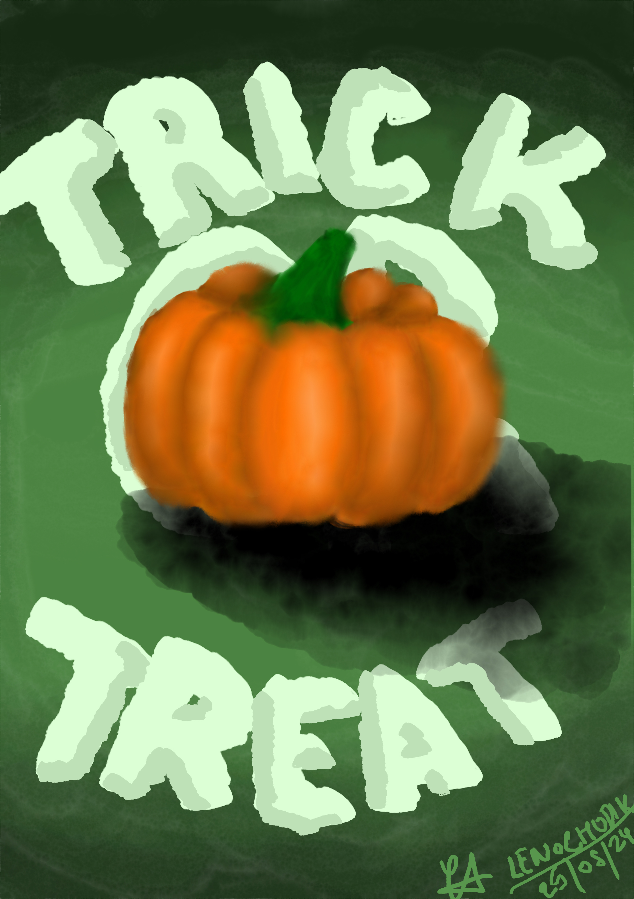
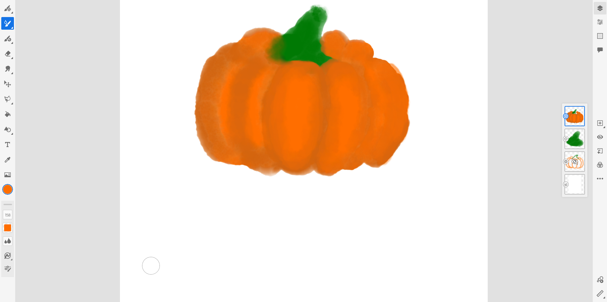
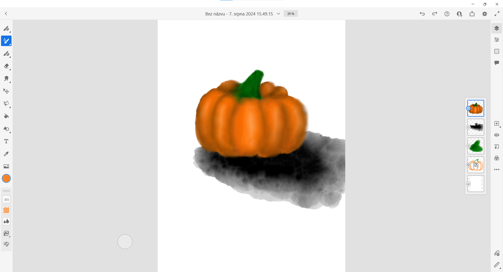

# Digital Painting - Pumpkin

This project was made in Adobe Fresco with usage of graphic tablet Wacom.

I used watercolor brush mostly and comics brush for the text.

## Final piece

## Progress

### First session

### Second session

### Third, final session

